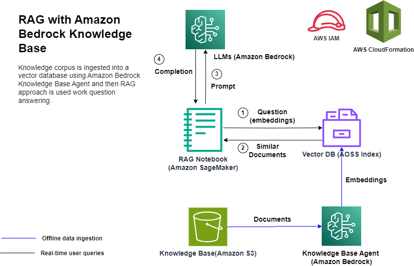

# Retrieval Augmented Generation using Amazon Bedrock

This repository provides sample code for implementing a question answering application using the Retrieval Augmented Generation (RAG) technique with Amazon Bedrock. A RAG implementation consists of two parts:

1. A data pipeline that ingests that from documents (typically stored in Amazon S3) into a knowledge base i.e. a vector database such as Amazon OpenSearch Service Serverless (AOSS) so that it is available for lookup when a question is received.

1. An application that receives a question from the user, looks up the knowledge base for relevant pieces of information (context) and then creates a prompt that includes the question and the context and provides it to an LLM for generating a response.

The data pipeline represents an undifferentiated heavy lifting and can be implemented using Amazon Bedrock Agents for knowledge Base. We can now connect an S3 bucket to a vector database such as AOSS and have a Bedrock Agent read the objects (html, pdf, text etc.), chunk them, and then convert these chunks into embeddings using Amazon Titan Embeddings model and then store these embeddings in AOSS. All of this without having to build, deploy and manage the data pipeline.

Once the data is available in the Bedrock Knowledge Base then a question answering application can be built using the following architectural pattern.

## Installation

Follow the steps listed below to create and run the RAG solution. The [blog_post.md](./blog_post.md) describes this solution in detail.

1. Launch the AWS CloudFormation template included in this repository using one of the buttons from the table below. The CloudFormation template creates the following resources within your AWS account: Amazon OpenSearch Service Serverless (AOSS) Collection, Amazon S3 bucket, IAM roles for Amazon Bedrock Knowledge Base Agent and Notebook and a Amazon SageMaker Notebook with this repository cloned to run the next steps.

   |AWS Region                |     Link        |
   |:------------------------:|:-----------:|
   |us-east-1 (N. Virginia)    |  |
   |us-west-2 (Oregon)          |  |

1. Follow instructions in [Build a RAG based question answer solution using Amazon Bedrock Knowledge Base and Amazon OpenSearch Service Serverless](./blog_post.md)

## Security

See [CONTRIBUTING](CONTRIBUTING.md#security-issue-notifications) for more information.

## License

This library is licensed under the MIT-0 License. See the [LICENSE](./LICENSE) file.

