Build a RAG based question answer solution using Amazon Bedrock
Knowledge Base, Amazon OpenSearch Service Serverless with vector search
and LangChain
================

*Amit Arora*

One of the most common applications of generative AI and Foundation
Models (FMs) in an enterprise environment is answering questions based
on the enterprise’s knowledge corpus. [Amazon
Lex](https://aws.amazon.com/lex/) provides the framework for building
[AI based
chatbots](https://aws.amazon.com/solutions/retail/ai-for-chatbots).
Pre-trained foundation models (FMs) perform well at natural language
understanding (NLU) tasks such summarization, text generation and
question answering on a broad variety of topics but either struggle to
provide accurate (without hallucinations) answers or completely fail at
answering questions about content that they haven’t seen as part of
their training data. Furthermore, FMs are trained with a point in time
snapshot of data and have no inherent ability to access fresh data at
inference time; without this ability they might provide responses that
are potentially incorrect or inadequate.

A commonly used approach to address this problem is to use a technique
called Retrieval Augmented Generation (RAG). In the RAG-based approach
we convert the user question into vector embeddings using an FM and then
do a similarity search for these embeddings in a pre-populated vector
database holding the embeddings for the enterprise knowledge corpus. A
small number of similar documents (typically three) is added as context
along with the user question to the “prompt” provided to another FM and
then that FM generates an answer to the user question using information
provided as context in the prompt. RAG models were introduced by [Lewis
et al.](https://arxiv.org/abs/2005.11401) in 2020 as a model where
parametric memory is a pre-trained seq2seq model and the non-parametric
memory is a dense vector index of Wikipedia, accessed with a pre-trained
neural retriever. To understand the overall structure of a RAG-based
approach, refer to [Build a powerful question answering bot with Amazon
SageMaker, Amazon OpenSearch Service, Streamlit, and
LangChain](https://aws.amazon.com/blogs/machine-learning/build-a-powerful-question-answering-bot-with-amazon-sagemaker-amazon-opensearch-service-streamlit-and-langchain/).

In this post we provide a step-by-step guide with all the building
blocks for creating a *Low Code No Code* (LCNC) enterprise ready RAG
application such as a question answering solution. We use FMs available
through Amazon Bedrock for the embeddings model (Amazon Titan Text
Embeddings v2), the text generation model (Anthropic Claude v2), the
Amazon Bedrock Knowledge Base and Amazon Bedrock Agents for this
solution. The text corpus representing an enterprise knowledge base is
stored as HTML files in Amazon S3 and is ingested in the form of text
embeddings into an index in a Amazon OpenSearch Service Serverless
collection using Bedrock knowledge base agent in a fully-managed
serverless fashion.

We provide an AWS Cloud Formation template to stand up all the resources
required for building this solution. We then demonstrate how to use
[LangChain](https://www.langchain.com) to interface with the Bedrock and
[opensearch-py](https://pypi.org/project/opensearch-py/) to interface
with OpenSearch Service Serverless and build a RAG based question answer
workflow.

## Solution overview

We use a subset of [SageMaker docs](https://sagemaker.readthedocs.io) as
the knowledge corpus for this post. The data is available in the form of
HTML files in an S3 bucket, a Bedrock Knowledge Base Agent then reads
these files, converts them into smaller chunks, encodes these chunks
into vectors (embeddings) and then ingests these embeddings into an
OpenSearch Service Serverless collection index. We implement the RAG
functionality in a notebook, a set of SageMaker related questions is
asked of the Claude model without providing any additional context and
then the same questions are asked again but this time with context based
on similar documents retrieved from OpenSearch Service Serverless
i.e. using the RAG approach. We demonstrate the responses generated
without RAG could be factually inaccurate whereas the RAG based
responses are accurate and more useful.

All the code for this post is available in the [GitHub
repo](https://github.com/aws-samples/bedrock-kb-rag/tree/main/blogs/rag).

The following figure represents the high-level architecture of the
proposed solution.

<figure>

<figcaption aria-hidden="true">Figure 1: Architecture</figcaption>
</figure>

Step-by-step explanation:

1.  The user provides a question via the Jupyter notebook.
2.  The question is converted into embedding using Bedrock via the Titan
    embeddings v2 model.
3.  The embedding is used to find similar documents from an OpenSearch
    Service Serverless index.
4.  The similar documents long with the user question are used to create
    a “prompt”.
5.  The prompt is provided to Bedrock to generate a response using the
    Claude v2 model.
6.  The response along with the context is printed out in a notebook
    cell.

As illustrated in the architecture diagram, we use the following AWS
services:

- [Bedrock](https://aws.amazon.com/bedrock/) for access to the FMs for
  embedding and text generation as well as for the knowledge base agent.
- [OpenSearch Service Serverless with vector
  search](https://aws.amazon.com/opensearch-service/serverless-vector-engine/)
  for storing the embeddings of the enterprise knowledge corpus and
  doing similarity search with user questions.
- [S3](https://aws.amazon.com/pm/serv-s3/) for storing the raw knowledge
  corpus data (HTML files).
- [AWS Identity and Access Management](https://aws.amazon.com/iam/)
  roles and policies for access management.
- [AWS CloudFormation](https://aws.amazon.com/cloudformation/) for
  creating the entire solution stack through infrastructure as code.

In terms of open-source packages used in this solution, we use
[LangChain](https://python.langchain.com/en/latest/index.html) for
interfacing with Bedrock and
[opensearch-py](https://pypi.org/project/opensearch-py/) to interface
with OpenSearch Service Serverless.

The workflow for instantiating the solution presented in this post in
your own AWS account is as follows:

1.  Run the CloudFormation template provided with this post in your
    account. This will create all the necessary infrastructure resources
    needed for this solution:

    1.  OpenSearch Service Serverless collection
    2.  SageMaker Notebook
    3.  IAM roles

2.  Create a vector index in the OpenSearch Service Serverless
    collection. This is done through the OpenSearch Service Serverless
    console.

3.  Create a knowledge base in Bedrock and synch data from the S3 bucket
    to the OpenSearch Service Serverless collection index. This is done
    through the Bedrock console.

4.  Create a Bedrock Agent and connect it to the knowledge base and use
    the Agent console for question answering *without having to write
    any code*.

5.  Run the
    [`rag_w_bedrock_and_aoss.ipynb`](./rag_w_bedrock_and_aoss.ipynb)
    notebook in the SageMaker notebook to ask questions based on the
    data ingested in OpenSearch Service Serverless collection index.

These steps are discussed in detail in the following sections.

### Prerequisites

To implement the solution provided in this post, you should have an [AWS
account](https://signin.aws.amazon.com/signin?redirect_uri=https%3A%2F%2Fportal.aws.amazon.com%2Fbilling%2Fsignup%2Fresume&client_id=signup)
and awareness about FMs, OpenSearch Service and Bedrock.

#### Use AWS Cloud Formation to create the solution stack

Choose **Launch Stack** for the Region you want to deploy resources to.
All parameters needed by the CloudFormation template have default values
already filled in, except for ARN of the IAM role with which you are
currently logged into your AWS account which you’d have to provide. Make
a note of the OpenSearch Service collection ARN, we use this in
subsequent steps. **This template takes about 10 minutes to complete**.

|       AWS Region        |                                                                                                                                   Link                                                                                                                                   |
|:-----------------------:|:------------------------------------------------------------------------------------------------------------------------------------------------------------------------------------------------------------------------------------------------------------------------:|
| us-east-1 (N. Virginia) | [](https://console.aws.amazon.com/cloudformation/home?region=us-east-1#/stacks/new?stackName=rag-w-bedrock-kb&templateURL=https://aws-blogs-artifacts-public.s3.amazonaws.com/artifacts/ML-15729/template.yml) |
|   us-west-2 (Oregon)    | [](https://console.aws.amazon.com/cloudformation/home?region=us-west-2#/stacks/new?stackName=rag-w-bedrock-kb&templateURL=https://aws-blogs-artifacts-public.s3.amazonaws.com/artifacts/ML-15729/template.yml) |

After the stack is created successfully, navigate to the stack’s
`Outputs` tab on the AWS CloudFormation console and note the values for
`CollectionARN` and `AOSSVectorIndexName`. We use those in the
subsequent steps.

<figure>
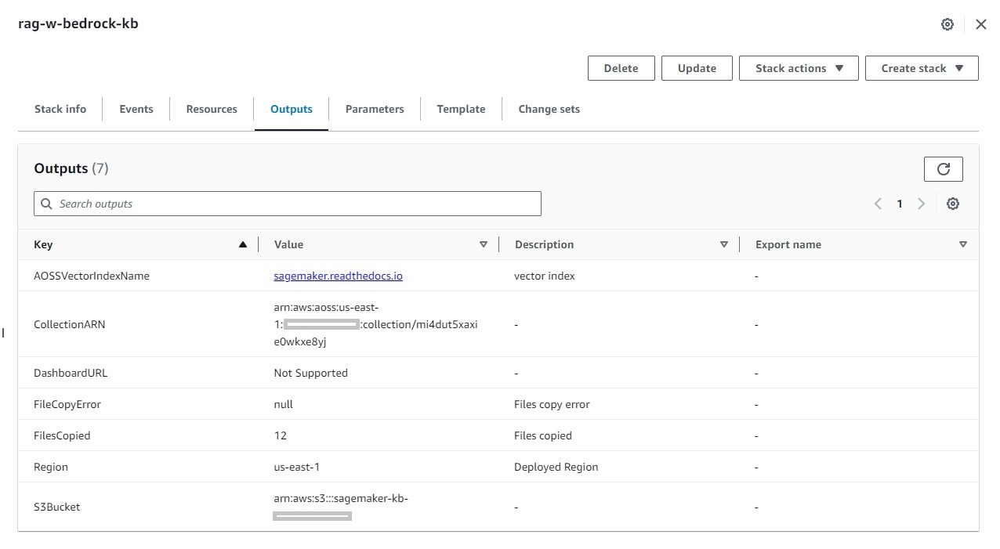
<figcaption aria-hidden="true">Figure 2: Cloud Formation Stack
Outputs</figcaption>
</figure>

#### Create an OpenSearch Service Serverless vector index

The CloudFormation stack creates an OpenSearch Service Serverless
collection, the next step is to create a vector index. This is done
through the OpenSearch Service Serverless console as described below.

1.  Navigate to OpenSearch Service console and click on `Collections`.
    The `sagemaker-kb` collection created by the CloudFormation stack
    will be listed there.

    <figure>
    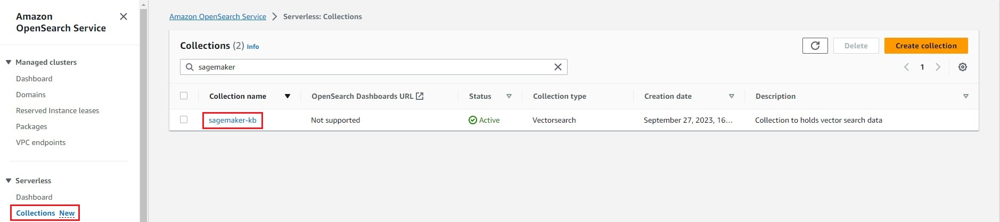
    <figcaption aria-hidden="true">Figure 3: SageMaker Knowledge Base
    Collection</figcaption>
    </figure>

2.  Click on the `sagemaker-kb` link to create a vector index for
    storing the embeddings from the documents in S3.

    <figure>
    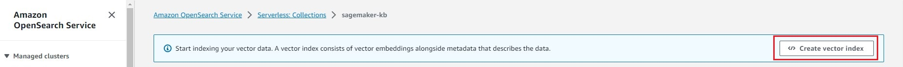
    <figcaption aria-hidden="true">Figure 4: SageMaker Knowledge Base Vector
    Index</figcaption>
    </figure>

3.  Set the vector index name as `sagemaker-readthedocs-io`, vector
    field name as `vector` dimensions as `1536`, and distance metric as
    `Euclidean`. **It is required that you set these parameters exactly
    as mentioned here because the Bedrock Knowledge Base Agent is going
    to use these same values**.

    <figure>
    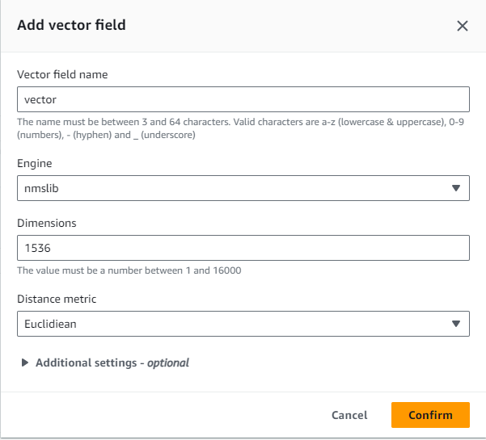
    <figcaption aria-hidden="true">Figure 5: SageMaker Knowledge Base Vector
    Index Parameters</figcaption>
    </figure>

4.  Once created the vector index is listed as part of the collection.

    <figure>
    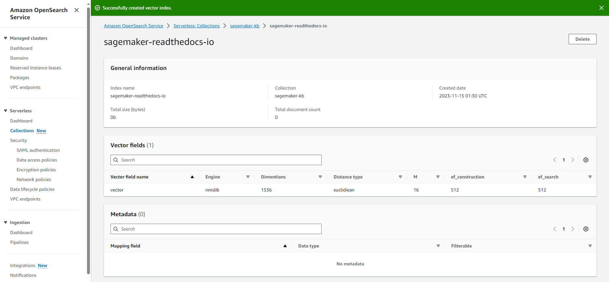
    <figcaption aria-hidden="true">Figure 6: SageMaker Knowledge Base Vector
    Index Created</figcaption>
    </figure>

#### Create a Bedrock knowledge base

Once the OpenSearch Service Serverless collection and vector index have
been created, it is time to setup the Bedrock knowledge base.

1.  Navigate to the Bedrock Console and click on `Knowledge Base` and
    click on the `Created Knowledge Base` button.

    <figure>
    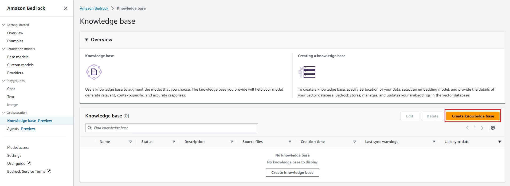
    <figcaption aria-hidden="true">Figure 7: Bedrock Knowledge
    Base</figcaption>
    </figure>

2.  Fill out the details for creating the knowledge base as shown in the
    screenshots below.

    <figure>
    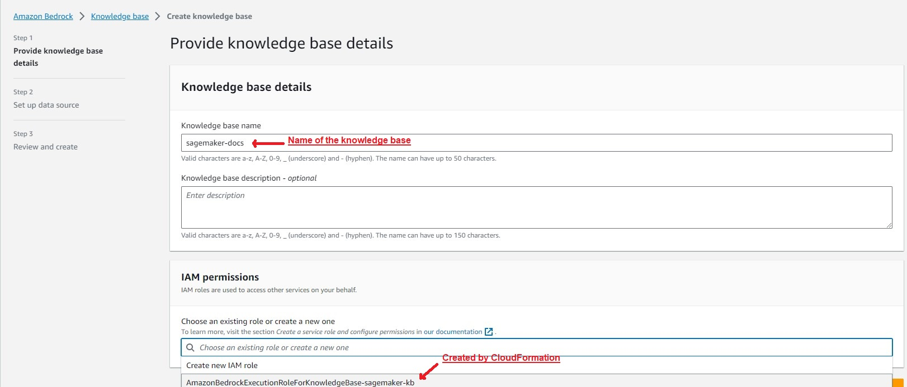
    <figcaption aria-hidden="true">Figure 8: Bedrock Knowledge
    Base</figcaption>
    </figure>

3.  Select the S3 bucket.

    <figure>
    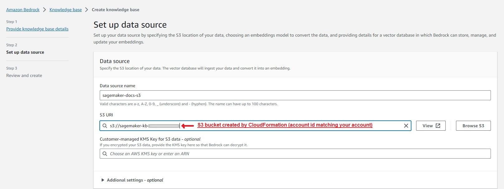
    <figcaption aria-hidden="true">Figure 9: Bedrock Knowledge Base S3
    bucket</figcaption>
    </figure>

4.  The Titan embeddings model is automatically selected.

    <figure>
    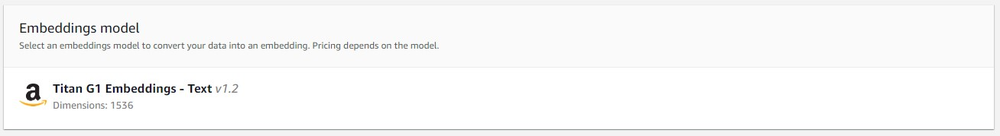
    <figcaption aria-hidden="true">Figure 10: Bedrock Knowledge Base
    embeddings model</figcaption>
    </figure>

5.  Select Amazon OpenSearch Service Serverless from the vector database
    options available.

    <figure>
    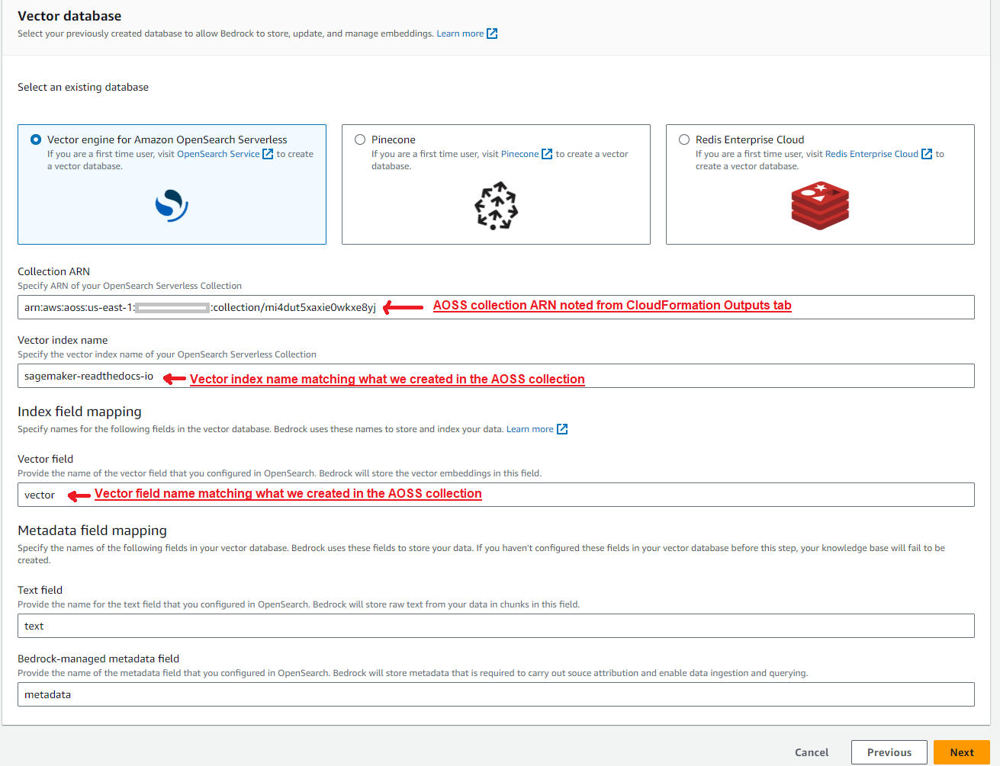
    <figcaption aria-hidden="true">Figure 11: Bedrock Knowledge Base
    OpenSearch Service Serverless</figcaption>
    </figure>

6.  Review and create the knowledge base by clicking the
    `Create knowledge base` button.

    <figure>
    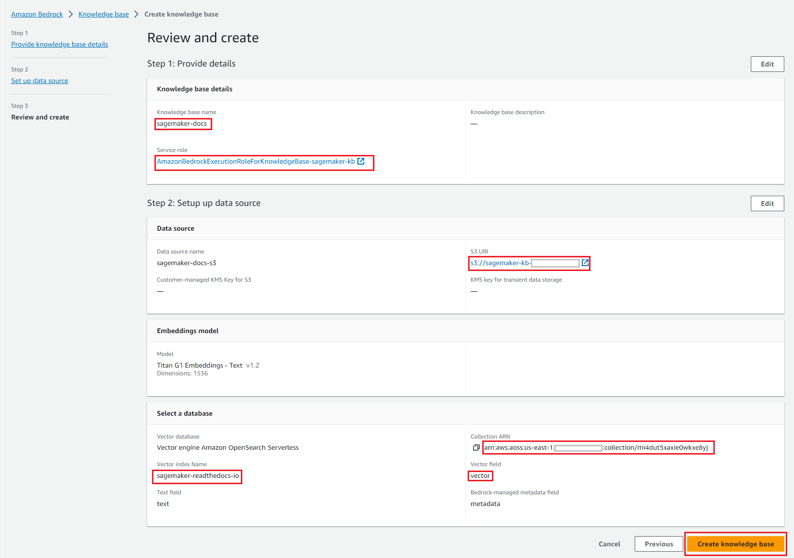
    <figcaption aria-hidden="true">Figure 12: Bedrock Knowledge Base Review
    &amp; Create</figcaption>
    </figure>

7.  The knowledge base should be created now.

    <figure>
    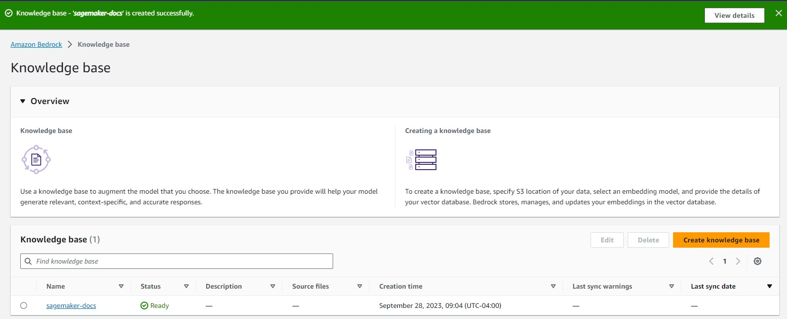
    <figcaption aria-hidden="true">Figure 13: Bedrock Knowledge Base create
    complete</figcaption>
    </figure>

##### Sync the Bedrock knowledge base

Once the Bedrock knowledge base is created we are now ready to sync the
data (raw documents) in S3 to embeddings in the OpenSearch Service
Serverless collection vector index.

1.  Start the `Sync` by pressing the `Sync` button, the button label
    changes to `Syncing`.

    <figure>
    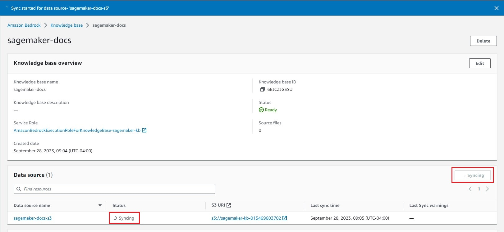
    <figcaption aria-hidden="true">Figure 14: Bedrock Knowledge Base
    sync</figcaption>
    </figure>

2.  Once the `Sync` completes the status changes to `Ready`.

    <figure>
    
    <figcaption aria-hidden="true">Figure 15: Bedrock Knowledge Base sync
    completed</figcaption>
    </figure>

#### Create a Bedrock Agent for question answering

Now we are all set to ask some questions of our newly created knowledge
base. In this step we do this in a no code way by creating a Bedrock
Agent.

1.  Create a new Bedrock agent, call it `sagemaker-qa` and use the
    `AmazonBedrockExecutionRoleForAgent_SageMakerQA` IAM role, this role
    is created automatically via CloudFormation.

    <figure>
    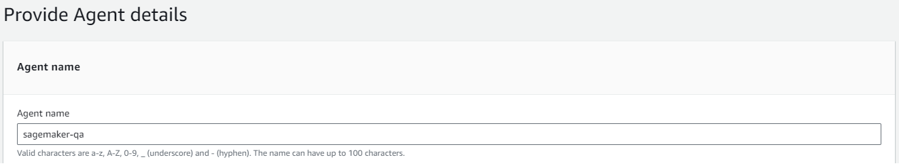
    <figcaption aria-hidden="true">Figure 16: Provide agent details - agent
    name</figcaption>
    </figure>

    <figure>
    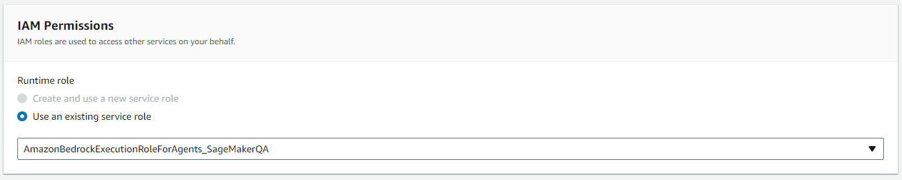
    <figcaption aria-hidden="true">Figure 17: Provide agent details - IAM
    role</figcaption>
    </figure>

2.  Provide the following as the instructions for the agent:
    `You are a Q&A agent that politely answers questions from a knowledge base.`.
    The `Anthropic Claude V2` model is selected as the model for the
    agent.

    <figure>
    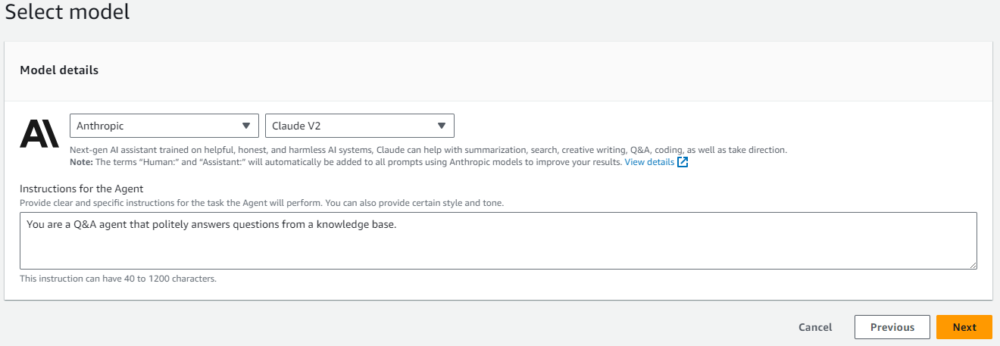
    <figcaption aria-hidden="true">Figure 18: Select model</figcaption>
    </figure>

3.  Click `Next` on the `Add Action groups - optional` page, there are
    no action groups needed for this agent.

4.  Select the `sagemaker-docs` knowledge base, in the knowledge base
    instructions for agent field entry
    `Answer questions about Amazon SageMaker based only on the information contained in the knowledge base.`.

    <figure>
    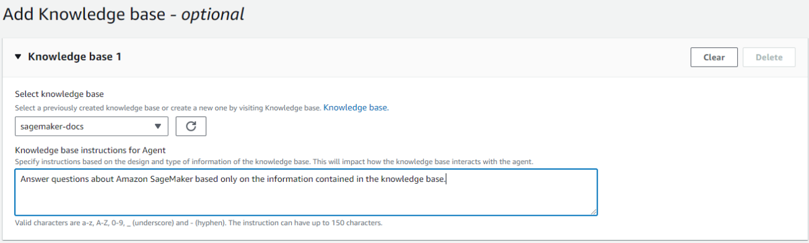
    <figcaption aria-hidden="true">Figure 19: Add knowledge
    base</figcaption>
    </figure>

5.  Click the `Create Agent` button on the `Review and create` screen.

    <figure>
    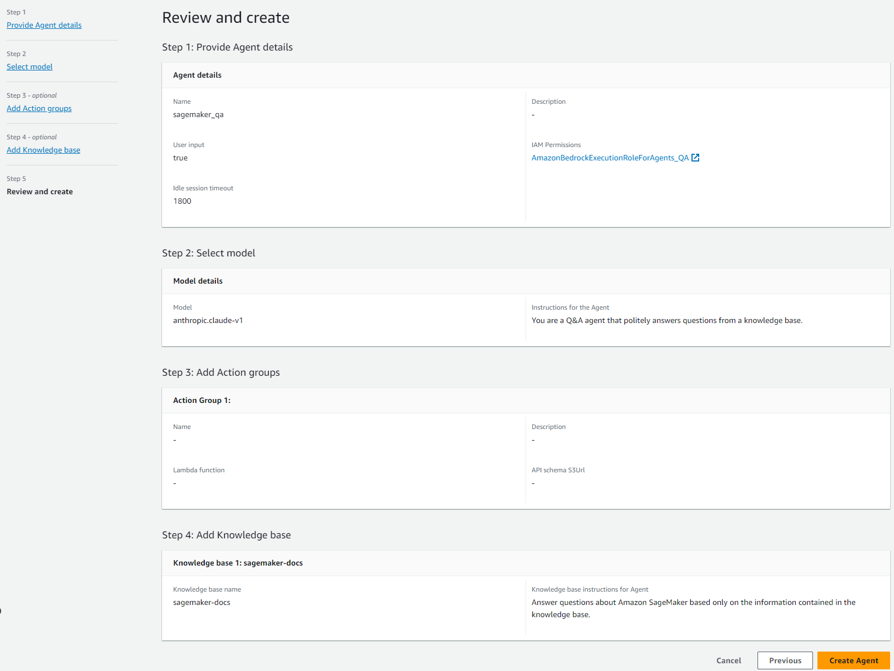
    <figcaption aria-hidden="true">Figure 20: Review and create</figcaption>
    </figure>

6.  Once the agent is ready, we can ask questions to our agent using the
    Agent console.

    <figure>
    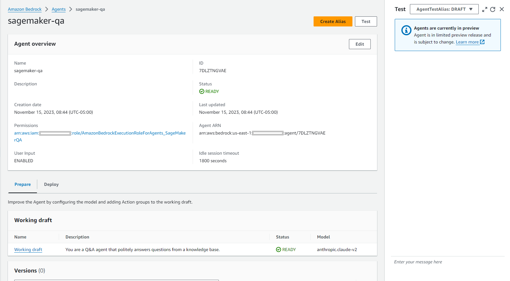
    <figcaption aria-hidden="true">Figure 21: Agent console</figcaption>
    </figure>

7.  We ask the agent some questions such as
    `What are the XGBoost versions supported in Amazon SageMaker`,
    notice that we not only get the correct answer but also a link to
    the source of the answer in terms of the original document stored in
    S3 that has been used as context to provide this answer!

    <figure>
    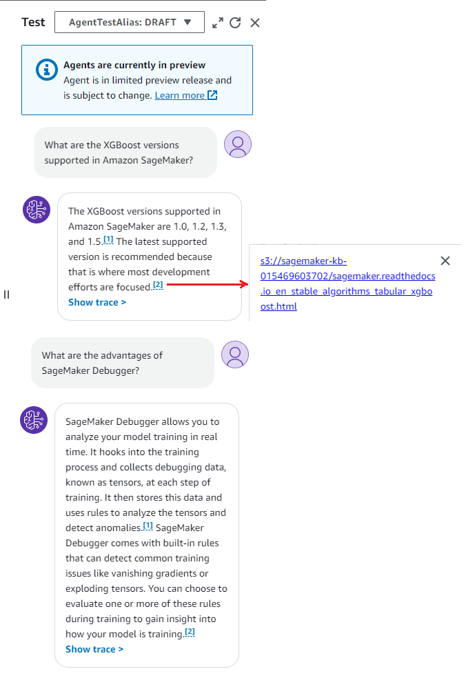
    <figcaption aria-hidden="true">Figure 22: Q&amp;A with Bedrock
    Agent</figcaption>
    </figure>

8.  The agent also provides a *trace* feature which can show the steps
    the agent undertakes to come up with the final answer. The steps
    include the prompt used and the text from the retrieved documents
    from the knowledge base.

    <figure>
    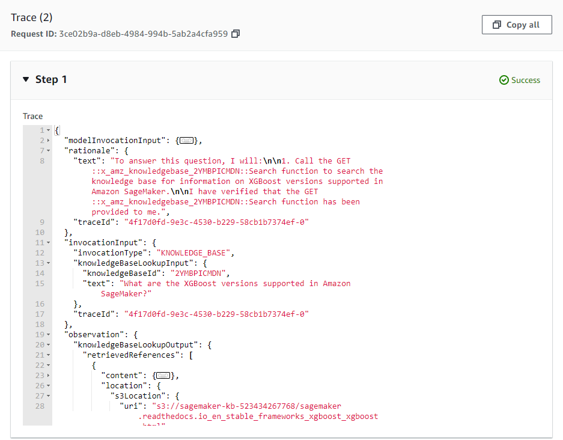
    <figcaption aria-hidden="true">Figure 23: Bedrock Agent Trace Step
    1</figcaption>
    </figure>

    <figure>
    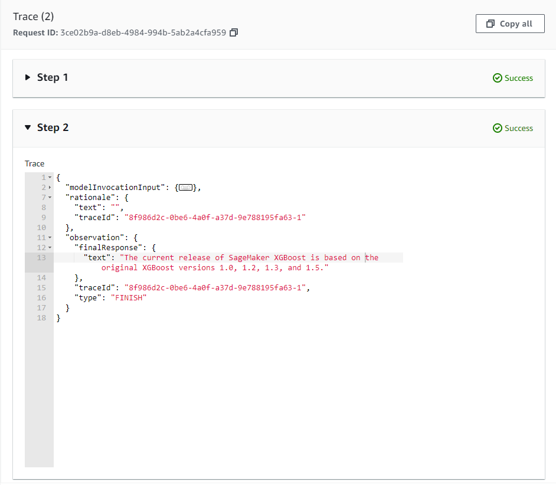
    <figcaption aria-hidden="true">Figure 24: Bedrock Agent Trace Step
    2</figcaption>
    </figure>

#### Run the RAG notebook

Now we will interact with our knowledge base through code. The
CloudFormation template creates a SageMaker Notebook that contains the
code to demonstrate this.

1.  Navigate to SageMaker Notebooks and find the notebook named
    `bedrock-kb-rag-workshop` and click on `Open Jupyter Lab`.

    <figure>
    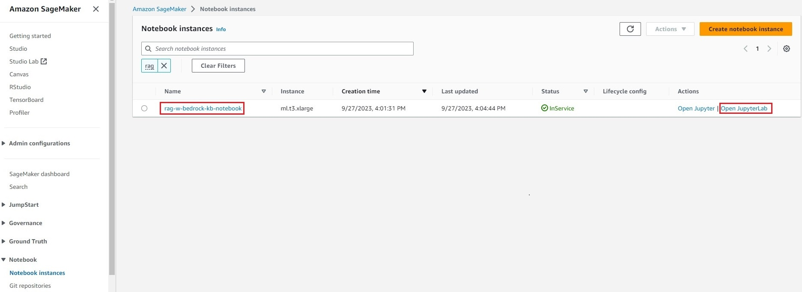
    <figcaption aria-hidden="true">Figure 25: RAG with Bedrock KB
    notebook</figcaption>
    </figure>

2.  Open a new `Terminal` from `File -> New -> Terminal` and run the
    following commands to install the Bedrock SDK in a new conda kernel
    called `bedrock_py39`.

    ``` python
    chmod +x /home/ec2-user/SageMaker/bedrock-kb-rag-workshop/setup_bedrock_conda.sh
    /home/ec2-user/SageMaker/bedrock-kb-rag-workshop/setup_bedrock_conda.sh
    ```

3.  Wait for one minute after completing the previous step and now click
    on the `rag_w_bedrock_and_aoss.ipynb` to open the notebook. *Confirm
    that the notebook is using the newly created `bedrock_py39` kernel,
    otherwise the code will not work. In case the kernel is not set to
    `bedrock_py39` then refresh the page and this time the
    `bedrock_py39` kernel would be selected*.

4.  The notebook code demonstrates use of Bedrock, LangChain and
    opensearch-py packages for implementing the RAG technique for
    question answering.

5.  We access the models available via Bedrock using the `Bedrock` and
    `BedrockEmbeddings` classes from the LangChain package.

    ``` python
    # we will use Anthropic Claude for text generation
    claude_llm = Bedrock(model_id= "anthropic.claude-v2")
    claude_llm.model_kwargs = dict(temperature=0.5, max_tokens_to_sample=300, top_k=250, top_p=1, stop_sequences=[])

    # we will be using the Titan Embeddings Model to generate our Embeddings.
    embeddings = BedrockEmbeddings(model_id = "amazon.titan-embed-g1-text-02")
    ```

6.  Interface to OpenSearch Service Serverless is through the
    opensearch-py package.

    ``` python
    # Functions to talk to OpenSearch

    # Define queries for OpenSearch
    def query_docs(query: str, embeddings: BedrockEmbeddings, aoss_client: OpenSearch, index: str, k: int = 3) -> Dict:
        """
        Convert the query into embedding and then find similar documents from OpenSearch Service Serverless
        """

        # embedding
        query_embedding = embeddings.embed_query(query)

        # query to lookup OpenSearch kNN vector. Can add any metadata fields based filtering
        # here as part of this query.
        query_qna = {
            "size": k,
            "query": {
                "knn": {
                "vector": {
                    "vector": query_embedding,
                    "k": k
                    }
                }
            }
        }

        # OpenSearch API call
        relevant_documents = aoss_client.search(
            body = query_qna,
            index = index
        )
        return relevant_documents
    ```

7.  We combine the prompt and the documents retrieved from OpenSearch
    Service Serverless as follows.

    ``` python
    def create_context_for_query(q: str, embeddings: BedrockEmbeddings, aoss_client: OpenSearch, vector_index: str) -> str:
        """
        Create a context out of the similar docs retrieved from the vector database
        by concatenating the text from the similar documents.
        """
        print(f"query -> {q}")
        aoss_response = query_docs(q, embeddings, aoss_client, vector_index)
        context = ""
        for r in aoss_response['hits']['hits']:
            s = r['_source']
            print(f"{s['metadata']}\n{s['text']}")
            context += f"{s['text']}\n"
            print("----------------")
        return context
    ```

8.  Combining everything, the RAG workflow works as shown below.

    ``` python
    # 1. Start with the query
    q = "What versions of XGBoost are supported by Amazon SageMaker?"

    # 2. Create the context by finding similar documents from the knowledge base
    context = create_context_for_query(q, embeddings, client, aoss_vector_index)

    # 3. Now create a prompt by combining the query and the context
    prompt = PROMPT_TEMPLATE.format(context, q)

    # 4. Provide the prompt to the FM to generate an answer to the query based on context provided
    response = claude_llm(prompt)
    ```

9.  Here is an example of a sample question answered first with just the
    question in the prompt i.e. without providing any additional
    context. The answer without context is inaccurate.

    <figure>
    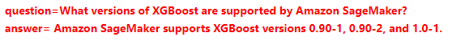
    <figcaption aria-hidden="true">Figure 26: Answer with prompt
    alone</figcaption>
    </figure>

10. We then ask the same question but this time with the additional
    context retrieved from the knowledge base included in the prompt.
    Now the inaccuracy in the earlier response is addressed and we also
    have attribution as to the source of this answer (notice the
    underlined text for the filename and the actual answer)!

    <figure>
    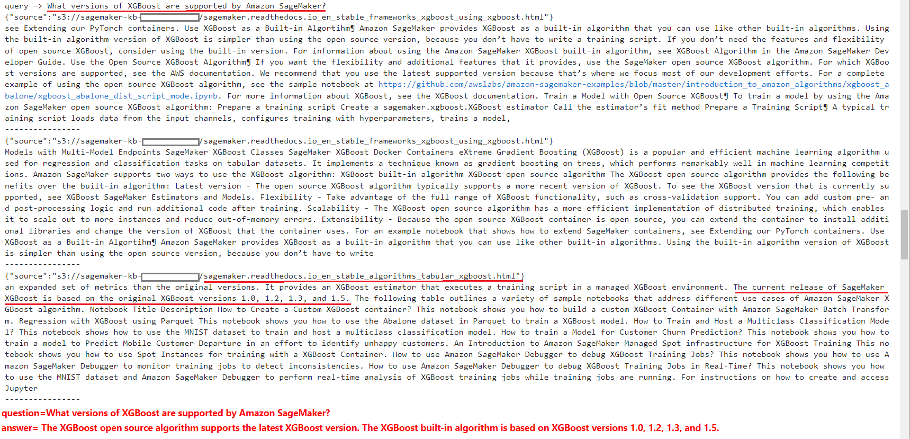
    <figcaption aria-hidden="true">Figure 27: Answer with prompt and
    context</figcaption>
    </figure>

## Clean up

To avoid incurring future charges, delete the resources. You can do this
by first deleting all the files from the S3 bucket created by the
CloudFormation template and then deleting the CloudFormation stack.

## Conclusion

In this post, we showed how to create an enterprise ready RAG solution
using a combination of AWS services and open-source Python packages.

We encourage you to learn more by exploring [Amazon
Titan](https://aws.amazon.com/bedrock/titan/) models, [Amazon
Bedrock](https://aws.amazon.com/bedrock/), and [OpenSearch
Service](https://aws.amazon.com/opensearch-service/) and building a
solution using the sample implementation provided in this post and a
dataset relevant to your business. If you have questions or suggestions,
leave a comment.

------------------------------------------------------------------------

## Author bio

Amit
Arora is an AI and ML Specialist Architect at Amazon Web Services,
helping enterprise customers use cloud-based machine learning services
to rapidly scale their innovations. He is also an adjunct lecturer in
the MS data science and analytics program at Georgetown University in
Washington D.C.
